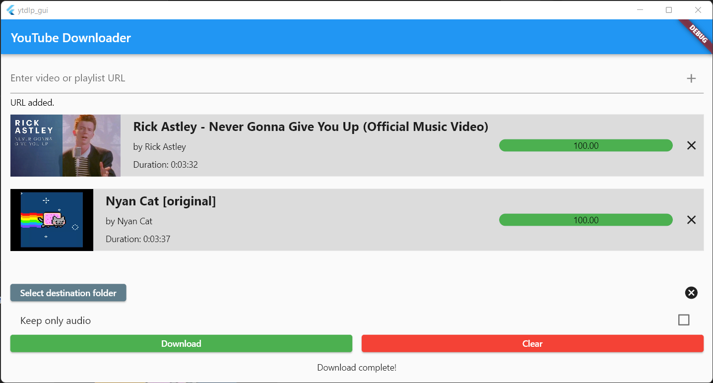

  <h3 align="center">YouTube Downloader GUI</h3>

  

    A GUI powered by <a href="https://github.com/yt-dlp/yt-dlp">yt-dlp</a> for downloading YouTube videos.
  

<!-- TABLE OF CONTENTS -->

  
Table of Contents

  <ol>
    <li>
      <a href="#about-the-project">About The Project</a>
      <ul>
        <li><a href="#built-with">Built With</a></li>
      </ul>
    </li>
    <li><a href="#usage">Usage</a></li>
    <li><a href="#roadmap">Roadmap</a></li>
    <li><a href="#license">License</a></li>
    <li><a href="#contact">Contact</a></li>
    <li><a href="#acknowledgments">Acknowledgments</a></li>
  </ol>

<!-- ABOUT THE PROJECT -->
## About The Project

  

A GUI-based program that lets you download videos off of YouTube with ease.

Allows you to queue videos and download multiple videos in one go.

Options can be easily applied according to your needs.

(<a href="#readme-top">back to top</a>)

### Built With

[![Flutter][Flutter.dev]][Flutter-url]

(<a href="#readme-top">back to top</a>)

<!-- USAGE EXAMPLES -->
## Usage

Click [here](https://github.com/brianyou0/cool-ytdl-gui/blob/c66fd74db5fc07a4f5b6d47ed8c51b5c2ac4d749/releases/ytdlp_gui.exe) to download the Windows (64-bit) version of this application.

Enter the link in the textbox and press "plus" to add that video.

Change the directory you wish to download the videos in by pressing **Set destination folder**.

Once you've added enough, press **Download** to download the videos!

(<a href="#readme-top">back to top</a>)

<!-- ROADMAP -->
## Roadmap

- [ ] Options
  - [ ] Second screen for options
  - [ ] Add file name option
- [ ] Multi-platform support
  - [ ] iOS
  - [ ] Android
- [ ] Playlists

(<a href="#readme-top">back to top</a>)

<!-- LICENSE -->
## License

Distributed under the MIT License. See `LICENSE.md` for more information.

(<a href="#readme-top">back to top</a>)

<!-- CONTACT -->
## Contact

Brian You - brianyou97@example.com

Project Link: [https://github.com/brianyou0/cool-ytdl-gui](https://github.com/brianyou0/cool-ytdl-gui)

(<a href="#readme-top">back to top</a>)

<!-- ACKNOWLEDGMENTS -->
## Acknowledgments
* [file_picker](https://pub.dev/packages/file_picker)
* [dio](https://pub.dev/packages/dio)
* [percent_indicator](https://pub.dev/packages/percent_indicator)
* [Best-README-Template](https://github.com/othneildrew/Best-README-Template)

(<a href="#readme-top">back to top</a>)

<!-- MARKDOWN LINKS & IMAGES -->
<!-- https://www.markdownguide.org/basic-syntax/#reference-style-links -->
[product-screenshot]: images/screenshot.png
[Flutter.dev]: https://img.shields.io/badge/Flutter-02569B?style=for-the-badge&logo=flutter&logoColor=white
[Flutter-url]: https://flutter.dev/
